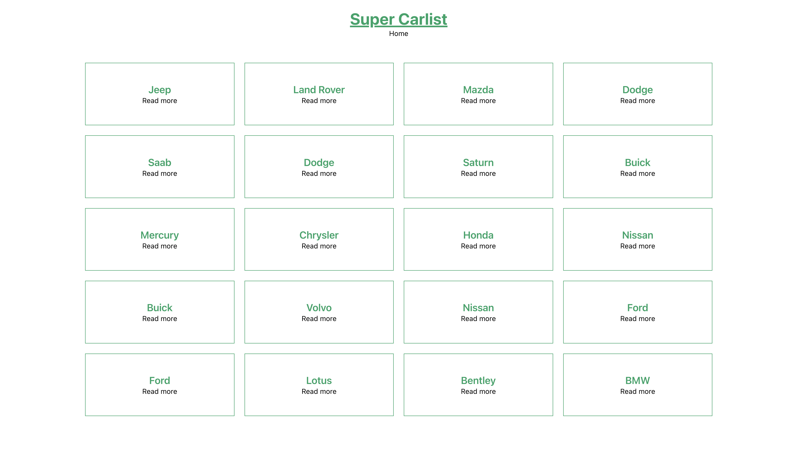
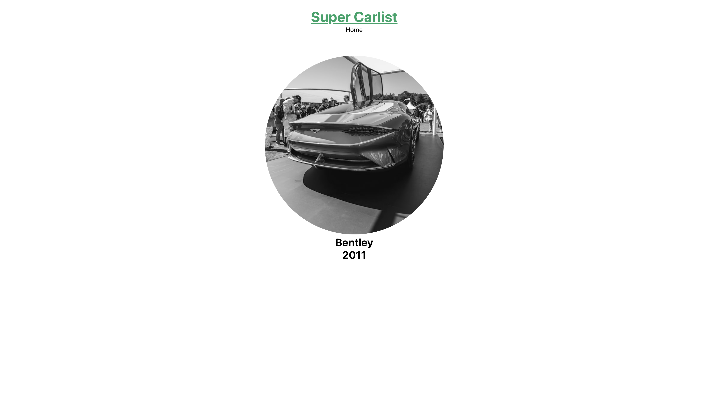

# super carlist created with react

Dynamic routing of a car list. The list should be generated from the cars.js file and displayed on the start page. On the start page each element gets a Read more link that leads to a subpage. On the subpage additional information about the car will be displayed.

## Demo

https://cinalselin-react-router-woodies.netlify.app/

## Screenshots

